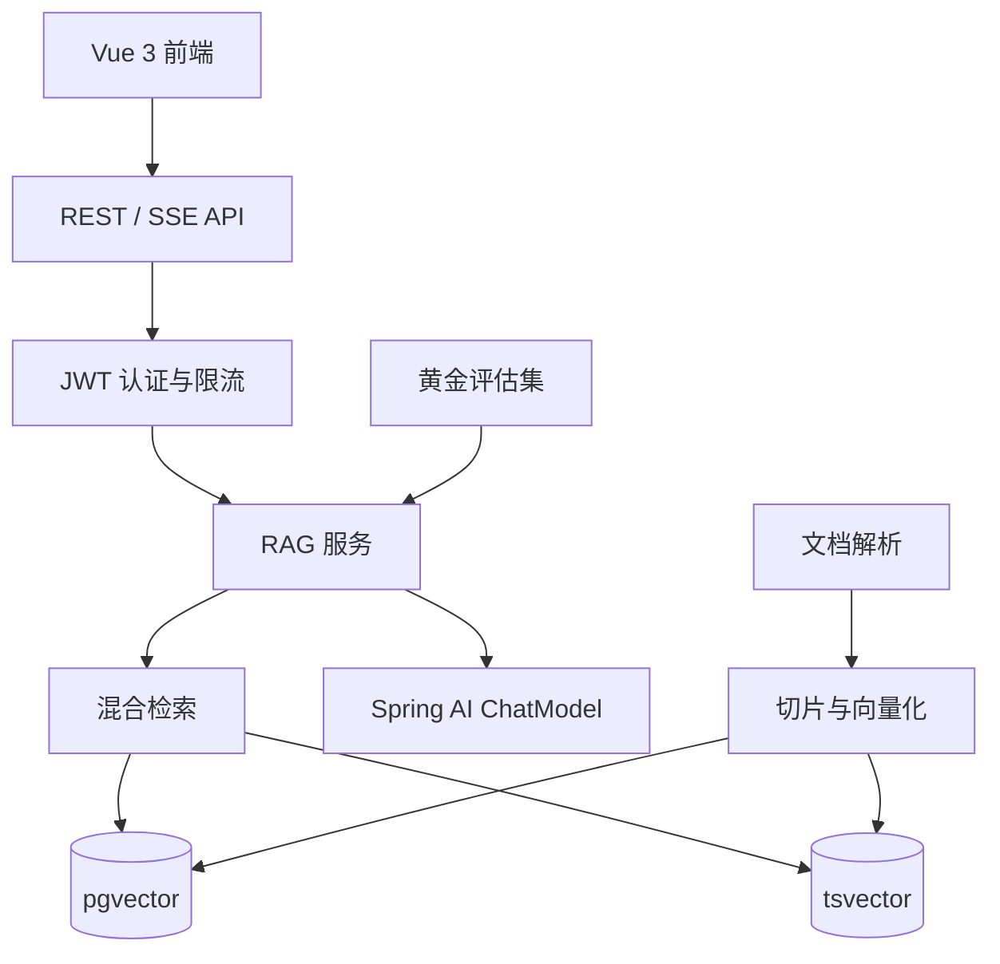

# 维基知识库（wikiknowledge）


> 企业级 RAG 知识库问答系统：Java 21 + Spring Boot + Spring AI + pgvector + Vue 3。
> 支持文档解析、混合检索、SSE 流式问答、会话记忆、评估报告、Docker 一键部署。

## 这个项目能做什么

上传 PDF / Word / Markdown / TXT 文档后，用户可以像聊天一样向知识库提问，系统会：

- 自动解析文档、切片并生成向量
- 通过“向量检索 + 关键词检索”混合召回相关内容
- 基于知识库内容流式回答，并返回引用来源
- 记录会话历史，支持多轮追问
- 管理员可以建立评估集，量化检索质量并导出 CSV 报告

## 为什么值得看

- 完整闭环：文档上传 -> 解析 -> 切片 -> 向量化 -> 检索 -> 问答 -> 反馈 -> 评估
- 真实工程化：JWT、限流、审计预留、测试、CI、Docker、Flyway
- 技术栈主流：Java 21 + Spring Boot 3.5 + Spring AI + pgvector + Redis + Vue 3
- 可扩展：V2 正在向“AI 教育助手”演进，包含知识点、智能出题、错题本
- 适合学习：每个类、每个复杂方法都有中文注释

## 架构



## 快速开始

### 1. 克隆项目

```bash
git clone https://github.com/xgwangdl/wikiknowledge.git
cd wikiknowledge
```

### 2. 配置环境变量

```bash
cp .env.example .env
```

至少配置 `AI_API_KEY`（DashScope 通义千问）。不配置也能启动，但 AI 功能不可用。

### 3. 一键启动

```bash
docker compose up -d --build
```

启动后：

- 前端：http://localhost:8081
- 后端健康检查：http://localhost:8080/actuator/health
- 默认管理员：`admin / admin123`

### 4. 本地开发

```bash
# 后端
mvn spring-boot:run

# 前端
cd frontend
npm install
npm run dev
```

## 核心能力

| 能力 | 说明 |
| --- | --- |
| 文档解析 | Tika 支持 PDF / DOCX / MD / TXT，SHA-256 去重 |
| 混合检索 | pgvector 向量 + tsvector 关键词，RRF 融合排序 |
| RAG 问答 | SSE 流式回答，返回引用来源，支持多轮上下文 |
| 回答稳定性 | 30 秒超时、自动重试、失败降级提示 |
| 成本控制 | 每日 AI 调用配额、问题长度限制 |
| 会话记忆 | 最近 10 轮历史自动带入 Prompt |
| 评估体系 | Recall@k / Precision@k / MRR，CSV 导出 |
| 问题建议 | 根据知识库内容生成推荐问题 |
| 安全与运维 | JWT、Redis 限流、提示注入防护、traceId、Docker、CI |

## 技术栈

| 层 | 技术 |
| --- | --- |
| 后端 | Java 21、Spring Boot 3.5、Spring Data JPA、Spring Security |
| AI | Spring AI 1.1、DashScope 千问（OpenAI 兼容模式） |
| 数据库 | PostgreSQL 16 + pgvector |
| 检索 | PostgreSQL tsvector 全文检索 + RRF 融合 |
| 缓存 | Redis 7 |
| 前端 | Vue 3、Element Plus、Vite |
| 部署 | Docker Compose、Nginx、GitHub Actions |

## API 概览

### 认证

```http
POST /api/auth/register
POST /api/auth/login
POST /api/auth/refresh
GET  /api/auth/me
```

### 知识库与文档

```http
GET    /api/knowledge-bases
POST   /api/knowledge-bases
PUT    /api/knowledge-bases/{id}
DELETE /api/knowledge-bases/{id}

POST   /api/knowledge-bases/{id}/documents
GET    /api/knowledge-bases/{id}/documents
GET    /api/documents/{id}
DELETE /api/documents/{id}
```

### 问答与会话

```http
POST /api/chat   # SSE
GET  /api/sessions
POST /api/sessions
GET  /api/sessions/{id}
GET  /api/knowledge-bases/{id}/suggestions
```

### 评估（管理员）

```http
POST /api/admin/evals/sets
GET  /api/admin/evals/sets
POST /api/admin/evals/runs
GET  /api/admin/evals/runs/{id}/export
```

## 项目结构

```text
wikiknowledge/
├── src/main/java/com/wikiknowledge/
│   ├── auth/          # JWT 与登录认证
│   ├── knowledge/     # 知识库管理
│   ├── document/      # 上传、解析、切片
│   ├── rag/           # 混合检索、SSE 问答、问题建议
│   ├── session/       # 会话与消息
│   ├── eval/          # 评估集与报告导出
│   ├── common/        # 通用响应、限流、成本控制
│   └── config/        # Web、traceId 配置
├── frontend/          # Vue 3 管理后台
├── docker-compose.yml
├── Dockerfile
└── .github/workflows/ci.yml
```

## 测试与构建

```bash
# 后端全部单元测试
mvn test

# 后端打包
mvn -DskipTests package

# 前端构建
cd frontend
npm run build
```

当前后端 53 个单元测试全部通过，前端生产构建通过。

## V2 规划

正在从“知识库问答”升级为“AI 教育助手”，核心闭环：

```text
学 -> 练 -> 测 -> 复习
```

详见 [REQUIREMENTS_V2.md](REQUIREMENTS_V2.md)。

## 文档

- [REQUIREMENTS.md](REQUIREMENTS.md)：V1 需求文档
- [REQUIREMENTS_V2.md](REQUIREMENTS_V2.md)：V2 教育助手需求文档
- [INTERVIEW_PREP.md](INTERVIEW_PREP.md)：面试准备材料

## License

本项目采用 [MIT License](LICENSE)。

如果你觉得这个项目对你有帮助，欢迎点个 Star ⭐ 支持一下。
