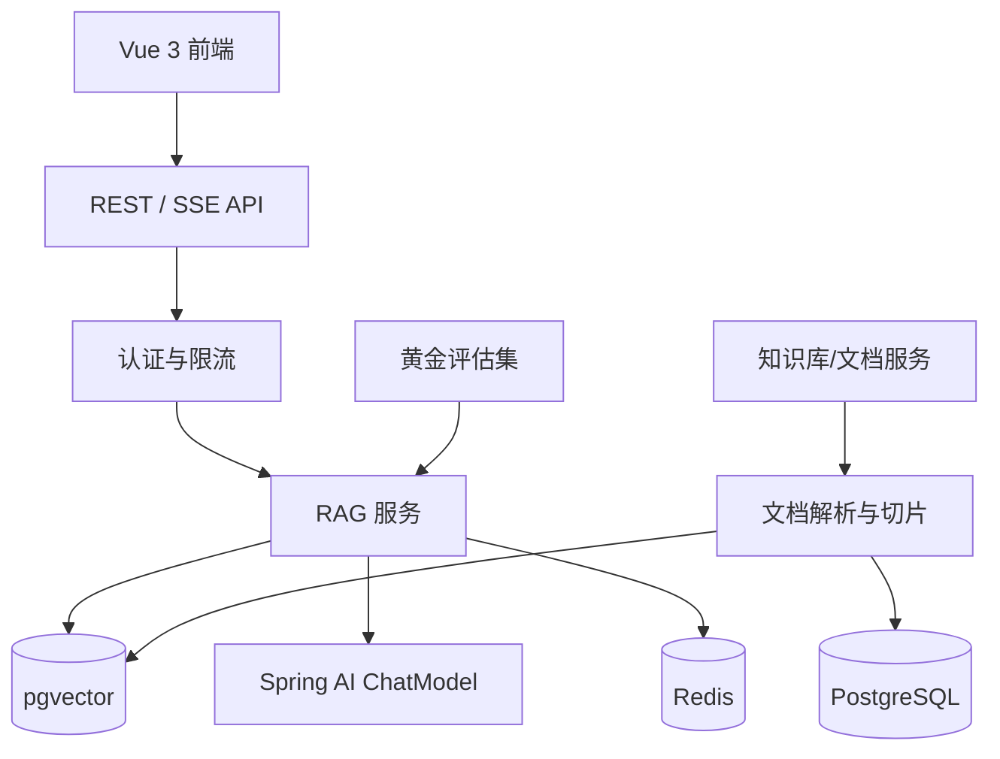

# 维基知识库（wikiknowledge）

基于 Java 21 + Spring Boot + Spring AI 的生产级 RAG 知识库问答系统。

本项目按“实战项目”标准开发：功能完整、有测试、可部署、可评估，适合作为 Java + AI 方向的项目经验展示。

## 核心能力

- 文档上传与解析：支持 PDF / DOCX / Markdown / TXT，Tika 自动提取文本
- 切片与向量化：段落级切片，embedding 写入 pgvector
- RAG 问答：向量检索 + 大模型生成，SSE 流式输出，返回引用来源
- 问题建议：根据知识库内容推荐用户可能想问的问题
- 会话与消息：多轮会话历史持久化
- 账号与权限：JWT 登录、刷新令牌、管理员权限
- 管理后台：Vue 3 页面管理知识库、文档和问答
- 安全与运维：Redis 限流、提示注入防护、traceId 日志链路
- 评估体系：黄金评估集，计算 Recall@k / Precision@k / MRR
- 评估中心：管理评估集、运行评估、导出 CSV 报告
- 部署与 CI：Docker Compose 一键启动，GitHub Actions 自动测试构建

## 技术栈

| 层 | 技术 |
| --- | --- |
| 后端 | Java 21、Spring Boot 3.5、Spring Data JPA、Spring Security |
| AI | Spring AI 1.1、DashScope 千问（OpenAI 兼容模式） |
| 数据库 | PostgreSQL 16 + pgvector |
| 缓存 | Redis 7 |
| 迁移 | Flyway |
| 文档解析 | Apache Tika |
| 前端 | Vue 3、Element Plus、Vite |
| 部署 | Docker Compose、Nginx、GitHub Actions |

## 架构



## 快速开始

### 1. 准备环境变量

```bash
cp .env.example .env
```

至少需要配置真实的 `AI_API_KEY`（DashScope），否则应用能启动，但文档向量化和问答会失败。

### 2. 一键启动

```bash
docker compose up -d --build
```

启动后：

- 前端：http://localhost:8081
- 后端健康检查：http://localhost:8080/actuator/health
- 默认管理员：`admin / admin123`

### 3. 本地开发

```bash
# 后端
mvn spring-boot:run

# 前端
cd frontend
npm install
npm run dev
```

前端开发服务器：http://localhost:5173，Vite 会把 `/api` 代理到 `http://localhost:8080`。

### 4. API 全链路联调

后端启动后，执行：

```bash
powershell -ExecutionPolicy Bypass -File scripts/api_smoke_test.ps1
```

脚本会自动完成：登录 -> 建库 -> 上传样例文档 -> 等待解析 -> 建会话 -> SSE 问答。

## API 概览

### 认证

```http
POST /api/auth/register
POST /api/auth/login
POST /api/auth/refresh
GET  /api/auth/me
```

### 知识库与文档

```http
GET    /api/knowledge-bases
POST   /api/knowledge-bases
PUT    /api/knowledge-bases/{id}
DELETE /api/knowledge-bases/{id}

POST   /api/knowledge-bases/{id}/documents
GET    /api/knowledge-bases/{id}/documents
GET    /api/documents/{id}
DELETE /api/documents/{id}
```

### 会话与问答

```http
GET    /api/sessions
POST   /api/sessions
GET    /api/sessions/{id}
DELETE /api/sessions/{id}

POST /api/chat   # SSE

GET  /api/knowledge-bases/{id}/suggestions
```

### 评估（管理员）

```http
POST /api/admin/evals/sets
GET  /api/admin/evals/sets
POST /api/admin/evals/runs
GET  /api/admin/evals/runs/{id}
GET  /api/admin/evals/runs
GET  /api/admin/evals/runs/{id}/export
```

## 项目结构

```text
wikiknowledge/
├── src/main/java/com/wikiknowledge/
│   ├── auth/          # JWT 与登录认证
│   ├── knowledge/     # 知识库管理
│   ├── document/      # 上传、解析、切片
│   ├── rag/           # RAG 检索、SSE 问答、提示防护
│   ├── session/       # 会话与消息
│   ├── eval/          # 评估集与评估报告
│   ├── common/        # 通用响应、限流
│   └── config/        # Web、traceId 配置
├── frontend/          # Vue 3 管理后台
├── docker-compose.yml
├── Dockerfile
└── .github/workflows/ci.yml
```

## 测试与验证

```bash
# 后端全部单元测试
mvn test

# 后端打包
mvn -DskipTests package

# 前端构建
cd frontend
npm run build
```

当前后端 44 个单元测试全部通过，前端生产构建通过。

## 文档

- [REQUIREMENTS.md](REQUIREMENTS.md)：需求文档
- [REQUIREMENTS_V2.md](REQUIREMENTS_V2.md)：V2.0 AI 教育助手需求文档
- [REVIEW.md](REVIEW.md)：每轮学习与 review 指引
- [INTERVIEW_PREP.md](INTERVIEW_PREP.md)：面试准备材料

## 开发状态

- [x] 项目初始化
- [x] 工程骨架（Maven + Spring Boot + 基础配置）
- [x] 本地 PostgreSQL/Redis + Flyway + 健康检查
- [x] 登录认证（Spring Security + JWT + 刷新令牌）
- [x] 知识库管理（创建/编辑/删除/列表 + 权限控制）
- [x] 文档上传与解析（Tika 文本提取 + 切片入库）
- [x] 向量化与 RAG 问答（pgvector 检索 + SSE 流式回答 + 引用来源）
- [x] 会话历史与消息持久化
- [x] 管理后台与前端（Vue 3 + Element Plus）
- [x] Docker Compose 部署与 GitHub Actions CI
- [x] 黄金评估集与评估报告
- [x] 性能与安全加固（Redis 限流、提示注入防护、traceId 日志）
- [x] README 完善与面试准备材料
