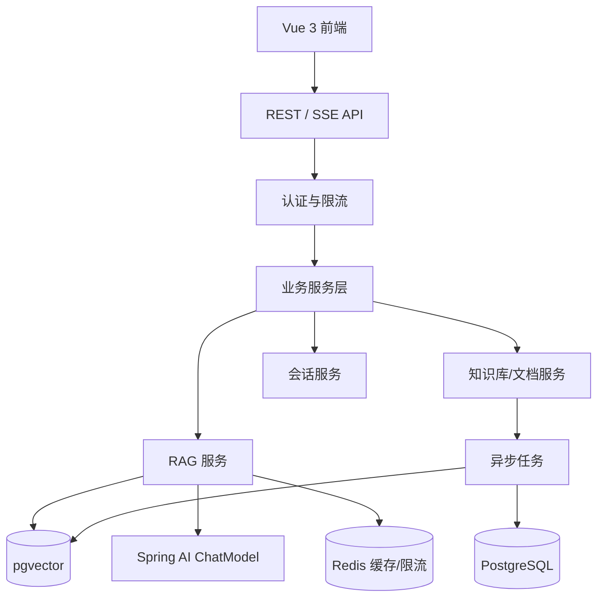

# AI 知识库问答系统需求文档

| 项 | 内容 |
| --- | --- |
| 项目代号 | AI-KB-QA |
| 文档版本 | v1.0 |
| 日期 | 2026-08-09 |
| 目标 | 从零实现一个生产级 Java + Spring AI RAG 问答系统，并可作为求职实战项目 |

## 1. 项目定位

面向企业/团队场景的“AI 知识库问答系统”：管理员上传文档建立知识库，用户以自然语言提问，系统通过 RAG 检索知识库内容，结合大模型生成带引用来源的回答，并支持会话记忆、反馈评估、安全控制与可观测性。

核心价值不是“接一个 AI 接口”，而是把一条完整的生产链路做扎实：

```text
文档解析 -> 切片 -> 向量化 -> 入库检索 -> 提示词组装 -> 流式回答 -> 引用来源 -> 反馈 -> 评估
```

## 2. 范围

### 2.1 本期做

| 优先级 | 模块 |
| --- | --- |
| P0 | 登录认证、知识库管理、文档上传解析、RAG 问答、流式输出、引用来源 |
| P0 | 会话历史、用户反馈、基础管理后台 |
| P1 | 混合检索（向量 + 关键词）、检索评估、可选 Rerank |
| P1 | 限流、提示注入防护、审计日志、结构化日志与指标 |
| P1 | JUnit + Testcontainers 集成测试、GitHub Actions CI、Docker Compose 部署 |
| P2 | 工具调用（Function Calling）、问题建议、评估集管理、导出报告 |

### 2.2 本期不做

- 多租户 SaaS 化
- 微服务拆分，保持单体 + 模块化
- 语音对话、视频、移动 App
- 复杂工作流编排
- 数据可视化大屏

## 3. 角色与权限

| 角色 | 说明 | 核心权限 |
| --- | --- | --- |
| 普通用户 | 使用知识库问答 | 登录、创建会话、提问、查看历史、提交反馈 |
| 管理员 | 运营与配置 | 知识库和文档管理、用户管理、模型配置、日志与评估 |

权限建议用简单的 `ROLE_USER` / `ROLE_ADMIN`，通过 JWT 携带角色，接口用注解或拦截器校验。

## 4. 功能需求

### FR-01 注册与登录（P0）

说明：

- 用户名 + 密码注册登录，密码使用 BCrypt 存储
- 登录成功返回 Access Token + Refresh Token
- Access Token 有效期短（如 30 分钟），Refresh Token 可轮换
- 提供管理员种子账号，初始化时创建

验收标准：

- 未登录访问业务接口返回 401
- 密码错误、用户禁用等返回明确错误码
- 刷新令牌可获取新 Access Token，旧 Refresh Token 失效

### FR-02 知识库管理（P0）

说明：

- 创建、编辑、删除、列表查询知识库
- 知识库包含名称、描述、可见范围（本期为全员可见）
- 删除知识库时级联删除文档、切片与向量

验收标准：

- 删除操作需要二次确认，前端明确提示
- 删除后文档不再被检索到

### FR-03 文档上传与异步解析（P0）

说明：

- 支持 PDF、DOCX、Markdown、TXT 格式
- 单文件限制 20MB，单次上传最多 10 个文件
- 上传后进入异步流水线：解析 -> 清洗 -> 切片 -> 向量化 -> 入库
- 文档状态：`UPLOADED -> PARSING -> INDEXING -> READY / FAILED`
- 使用文件哈希去重，同一知识库不重复入库
- 保存来源元数据：文件名、页号、段落序号、文档 URL 等

验收标准：

- 上传 PDF 后能在管理后台看到状态流转
- 解析失败时状态为 `FAILED` 且记录可读错误信息
- 同一文件重复上传提示“已存在”

### FR-04 切片与向量化策略（P0）

说明：

- 切片参数可配置：`chunk_size`、`chunk_overlap`、分隔符策略
- 切片时保留标题/段落结构，避免把无关内容切进同一块
- 向量化使用固定维度 embedding 模型，配置统一
- 向量存储使用 PostgreSQL + pgvector，索引使用 HNSW

验收标准：

- 同一份测试文档的切片结果可重复生成
- 切片数量、token 数、字符数有日志记录
- 向量入库失败时能重试或失败回滚

### FR-05 RAG 问答（P0）

说明：

- 创建会话时选择知识库，会话内支持多轮提问
- 每次提问：权限校验 -> 限流 -> 检索 -> 组装 Prompt -> 流式返回
- 回答必须附引用来源（文档名、页号或切片内容）
- 未检索到相关内容时明确提示“知识库中没有相关资料”
- 支持中断、超时、失败重试与降级提示

验收标准：

- 浏览器收到 SSE 流式输出，首 token 时间小于 2 秒（同区域测试）
- 回答内容与检索来源一致，能点开引用来源
- 无相关内容时不编造答案

### FR-06 混合检索（P1）

说明：

- 向量检索：`pgvector` cosine 相似度
- 关键词检索：PostgreSQL 全文检索 `tsvector`
- 结果融合：加权合并或 RRF（Reciprocal Rank Fusion）
- 支持 `top_k`、相似度阈值、按知识库过滤

验收标准：

- 提供评估脚本对比“纯向量 / 纯关键词 / 混合”三种模式的 Recall@k
- 检索日志记录命中的 chunk id 与得分

### FR-07 会话与历史（P0）

说明：

- 会话列表、删除、重命名
- 会话内消息持久化，刷新页面后历史可恢复
- 上下文默认携带最近 5 轮或按 token 预算截断

验收标准：

- 追问“那第二点呢”能结合上文正确回答
- 历史消息展示与数据库记录一致

### FR-08 反馈与评估（P1）

说明：

- 每条回答支持点赞/点踩和原因
- 后台可查看反馈列表与统计
- 支持导入“黄金问答集”（JSON），运行离线评估
- 评估指标：`Recall@k`、`Precision@k`、`MRR`、回答相关性评分

验收标准：

- 评估一次运行有完整报告，可导出 CSV
- 修改检索或 Prompt 后可重新运行评估对比

### FR-09 工具调用（P2）

说明：

- 提供 2-3 个示例工具：当前时间、数学计算、模拟数据查询
- 模型通过 Function Calling 调用工具，结果回填后继续生成
- 工具执行有超时、白名单和异常兜底

验收标准：

- 提问“今天日期”能返回真实结果
- 工具异常时回答不中断，提示稍后重试

### FR-10 管理后台（P0）

说明：

- 知识库与文档看板：数量、状态、失败原因
- 用户管理：列表、启用/禁用
- 问答日志：会话、耗时、token、引用
- 模型配置：选择模型和参数；API Key 不落库明文，统一走环境变量
- 反馈与评估入口

验收标准：

- 管理员能完成“上传文档 -> 提问 -> 查看日志 -> 查看反馈”完整闭环

### FR-11 安全要求（P1）

说明：

- JWT 鉴权 + RBAC
- 全局限流：每用户每分钟次数、每日次数可配置
- Prompt 注入防护：System Prompt 约束、输入长度限制、危险词检测
- 文件上传：扩展名白名单、大小限制、文件头校验
- 禁止抓取内网地址，避免 SSRF
- 所有密钥通过环境变量注入，提供 `.env.example`
- 登录、删除、配置变更写入审计日志
- CORS 使用白名单，不开放任意来源

验收标准：

- 越权访问返回 403
- 限流触发返回 429
- 仓库内搜不到真实密钥

### FR-12 可观测性与运维（P1）

说明：

- 结构化 JSON 日志：`traceId`、`userId`、`kbId`、`latency`
- Micrometer 指标：检索延迟、LLM 延迟、token 用量、错误率
- Spring Boot Actuator 健康检查
- Flyway 管理数据库结构
- Docker Compose 一键启动应用、PostgreSQL、Redis

验收标准：

- `/actuator/health` 返回 UP
- 一条完整问答能在日志中串联 trace
- 数据库结构变更通过 Flyway 迁移，不手改表结构

## 5. 技术栈

| 层 | 选型 |
| --- | --- |
| 语言 | Java 21 |
| 后端框架 | Spring Boot 3.5+（GA） |
| AI | Spring AI 1.x（GA）+ Spring AI Alibaba（如使用通义千问/DashScope） |
| 数据库 | PostgreSQL 16 + pgvector |
| 缓存 | Redis |
| ORM | Spring Data JPA |
| 迁移 | Flyway |
| 鉴权 | Spring Security + JWT |
| 测试 | JUnit 5、Testcontainers、Mockito |
| 前端 | Vue 3 + Element Plus + Vite |
| 部署 | Docker Compose、GitHub Actions |
| 可观测 | Micrometer + Prometheus + Grafana（可选） |

## 6. 架构



## 7. 数据模型

核心表：

| 表 | 关键字段 | 说明 |
| --- | --- | --- |
| `users` | id, username, password_hash, role, status | 用户 |
| `knowledge_bases` | id, name, description, status | 知识库 |
| `documents` | id, kb_id, filename, file_hash, size, status, error_msg | 文档 |
| `chunks` | id, doc_id, kb_id, content, meta, token_count, embedding | 切片与向量 |
| `sessions` | id, user_id, kb_id, title | 会话 |
| `messages` | id, session_id, role, content, citations, tokens, feedback, latency_ms | 消息 |
| `eval_sets` | id, name, description | 评估集 |
| `eval_questions` | id, eval_set_id, question, expected_answer | 黄金问题 |
| `eval_runs` | id, eval_set_id, status, metrics, report | 评估运行 |
| `audit_logs` | id, user_id, action, target, detail, created_at | 审计日志 |

## 8. API 设计（核心）

### 认证

```http
POST /api/auth/register
POST /api/auth/login
POST /api/auth/refresh
```

### 知识库与文档

```http
GET    /api/knowledge-bases
POST   /api/knowledge-bases
GET    /api/knowledge-bases/{id}
PUT    /api/knowledge-bases/{id}
DELETE /api/knowledge-bases/{id}

GET    /api/knowledge-bases/{id}/documents
POST   /api/knowledge-bases/{id}/documents   # multipart 上传
GET    /api/documents/{id}
DELETE /api/documents/{id}
POST   /api/documents/{id}/reindex
```

### 会话与问答

```http
GET    /api/sessions
POST   /api/sessions
GET    /api/sessions/{id}/messages
DELETE /api/sessions/{id}

POST /api/chat   # text/event-stream
```

SSE 事件示例：

```text
event: start
data: {"sessionId":"...","messageId":"..."}

event: delta
data: {"content":"知识库..."}

event: done
data: {"citations":[{"documentId":"...","fileName":"...","page":3}],"tokens":{"input":500,"output":120}}

event: error
data: {"code":"RATE_LIMITED","message":"请稍后再试"}
```

### 反馈与评估

```http
POST /api/feedback
GET  /api/admin/stats
POST /api/admin/evals/runs
GET  /api/admin/evals/runs/{id}
```

## 9. 非功能需求

| 指标 | 目标 |
| --- | --- |
| 检索 P95 | < 500ms |
| 首 token P95 | < 2s |
| 完整回答 | 普通文档问题 < 15s |
| 并发 | 单机支撑 50 并发用户 |
| 可用性 | 常规运行不宕机，AI 接口失败时优雅降级 |
| 测试 | 核心服务覆盖率 > 70%，CI 全绿 |
| 成本 | 单问题 token 上限，可配置，避免失控 |
| 兼容 | Chrome / Edge 最新版，移动端可用 |

## 10. 测试与验收

### 测试层次

- 单元测试：切片器、Prompt 组装、检索融合、权限校验
- 集成测试：Testcontainers 启动 pgvector + Redis，覆盖文档入库和问答主流程
- 安全测试：未授权、越权、恶意文件、限流
- 评估测试：黄金问答集回归
- 性能冒烟：50 个并发提问，检查延迟与错误率

### 最终验收

- 一条命令 `docker compose up -d` 启动
- 管理员上传 3 种格式文档后可正常问答并展示引用
- 项目包含 README、架构图、部署说明、API 文档
- GitHub Actions 构建、测试、镜像构建全部通过
- 面试时可以完整讲清：架构、检索链路、难点、评估结果、部署方式

## 11. 里程碑

| 阶段 | 时间 | 目标 |
| --- | --- | --- |
| M1 | 第 1-2 周 | 项目骨架、登录、知识库、文档上传、基础 RAG 问答 |
| M2 | 第 3-4 周 | 流式输出、引用来源、会话历史、混合检索 |
| M3 | 第 5-6 周 | 管理后台、反馈、限流、安全加固 |
| M4 | 第 7-8 周 | Testcontainers 测试、指标日志、CI、Docker 部署 |
| M5 | 第 9-10 周 | 黄金评估集、评估报告、README、演示数据 |
| M6 | 第 11-12 周 | 性能优化、面试问题准备、简历项目描述 |

## 12. 主要风险与应对

| 风险 | 应对 |
| --- | --- |
| 文档解析效果差 | 先用少量真实文档跑通，再逐步加格式兼容 |
| 检索结果不准 | 提前做黄金评估集，用数据调优而不是靠感觉 |
| AI 成本失控 | 限制单次 token、加缓存、设置每日配额 |
| 三个月时间不够 | 砍掉 P2 功能，优先保证 P0 链路完整 |
| 项目像“教程 Demo” | 必须包含测试、部署、评估、安全这些非 AI 功能 |
